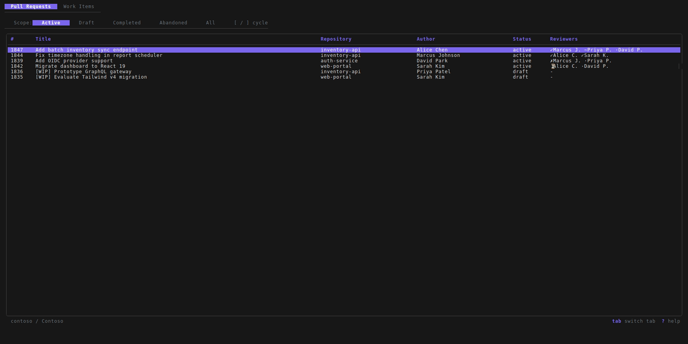

<p align="center">
  <strong>azboard</strong><br>
  A fast, keyboard-driven terminal UI for Azure DevOps
</p>

<p align="center">
  <a href="https://github.com/Popplywop/azboard/releases/latest">Latest Release</a> &middot;
  <a href="https://popplywop.github.io/azboard">Documentation</a> &middot;
  <a href="#installation">Install</a> &middot;
  <a href="#quick-start">Quick Start</a>
</p>

---

<p align="center">
  
</p>

---

Review pull requests, manage work items, and interact with your ADO project without
leaving the terminal. Built with [Bubble Tea](https://github.com/charmbracelet/bubbletea),
[Bubbles](https://github.com/charmbracelet/bubbles), and
[Lip Gloss](https://github.com/charmbracelet/lipgloss).

## Table of Contents

- [Installation](#installation)
- [Quick Start](#quick-start)
- [Configuration](#configuration)
- [Usage](#usage)
- [Features](#features)
- [Keybindings](#keybindings)
- [Verifying Releases](#verifying-releases)
- [Contributing](#contributing)
- [License](#license)

---

## Installation

### Linux & macOS

```bash
curl -fsSL https://popplywop.github.io/azboard/install.sh | sh
```

Installs the latest release to `/usr/local/bin`. To install elsewhere:

```bash
INSTALL_DIR=~/.local/bin curl -fsSL https://popplywop.github.io/azboard/install.sh | sh
```

### Windows (PowerShell)

```powershell
iwr https://popplywop.github.io/azboard/install.ps1 | iex
```

Installs to `%LOCALAPPDATA%\azboard` and adds it to your user `PATH` automatically. To install elsewhere:

```powershell
$env:INSTALL_DIR="C:\Tools"; iwr https://popplywop.github.io/azboard/install.ps1 | iex
```

### Pre-built Binaries

Download the latest release for your platform from the
[releases page](https://github.com/Popplywop/azboard/releases/latest):

| Platform | File |
|----------|------|
| Linux x86-64 | `azboard_*_linux_amd64.tar.gz` |
| Linux ARM64 | `azboard_*_linux_arm64.tar.gz` |
| macOS Intel | `azboard_*_darwin_amd64.tar.gz` |
| macOS Apple Silicon | `azboard_*_darwin_arm64.tar.gz` |
| Windows x86-64 | `azboard_*_windows_amd64.zip` |

Extract and move the `azboard` binary somewhere on your `$PATH`.

### Build from Source

Requires Go 1.21+.

```bash
git clone https://github.com/Popplywop/azboard
cd azboard
go build -o azboard .
mv azboard /usr/local/bin/azboard
```

---

## Quick Start

1. **Install azboard** using one of the methods above.

2. **Create a config file** at `~/.config/azboard/config.json`:

   ```json
   {
     "org_url": "https://dev.azure.com/your-org",
     "project": "your-project"
   }
   ```

3. **Authenticate** -- either log in with Azure CLI (recommended):

   ```bash
   az login
   ```

   Or add a PAT to your config:

   ```json
   {
     "org_url": "https://dev.azure.com/your-org",
     "project": "your-project",
     "auth_method": "pat",
     "pat": "your-personal-access-token"
   }
   ```

4. **Launch azboard:**

   ```bash
   azboard
   ```

5. **Select repositories** -- press `R` to open the repo picker, select repos with
   `space`, and press `ctrl+s` to save your selection to the config file.

---

## Configuration

All settings are read from `~/.config/azboard/config.json`.

### Full Example

```json
{
  "org_url": "https://dev.azure.com/your-org",
  "project": "your-project",
  "auth_method": "azcli",
  "repos": ["my-api", "my-frontend"],
  "work_item_types": ["User Story", "Bug", "Task", "Feature", "Epic"],
  "default_merge_strategy": "squash",
  "area_path": "your-project\\your-team"
}
```

### Config Reference

| Field | Required | Default | Description |
|-------|:--------:|---------|-------------|
| `org_url` | Yes | -- | Your Azure DevOps URL. Supports both `https://dev.azure.com/org` and `https://org.visualstudio.com` formats. |
| `project` | Yes | -- | Project name. Can also be embedded in `org_url` (e.g. `https://dev.azure.com/org/project`). |
| `auth_method` | No | `"azcli"` | Authentication method: `"azcli"` or `"pat"`. |
| `pat` | If `auth_method` is `"pat"` | -- | Personal access token with `Code (Read & Write)` and `Work Items (Read & Write)` scopes. |
| `repos` | No | `[]` | Repositories to load on startup. Use the interactive picker (`R`) to select and save. |
| `work_item_types` | No | `["User Story", "Bug", "Task", "Feature", "Epic"]` | Work item types to display. |
| `default_merge_strategy` | No | `"squash"` | Default merge strategy: `"squash"`, `"merge"`, `"rebase"`, or `"semilinear"`. |
| `area_path` | No | -- | Filter work items to a specific area path (e.g. `"Project\\Team"`). |

### Authentication

**Azure CLI (recommended):** Install the [Azure CLI](https://learn.microsoft.com/en-us/cli/azure/install-azure-cli)
and run `az login`. azboard automatically obtains and refreshes tokens via
`az account get-access-token`.

**Personal Access Token:** Generate a PAT in
[Azure DevOps](https://learn.microsoft.com/en-us/azure/devops/organizations/accounts/use-personal-access-tokens-to-authenticate)
with the following scopes:

- `Code` -- Read & Write
- `Work Items` -- Read & Write

---

## Usage

```bash
azboard                # Launch the TUI
azboard --pr 12345     # Jump directly to a specific PR
azboard --version      # Print version
```

On first launch with no `repos` configured, you will see an empty state. Press `R`
to open the repo picker and select which repositories to load.

---

## Features

### Pull Requests

| Capability | How |
|------------|-----|
| List PRs across all configured repos | Shown on launch |
| Scope views (Active, Draft, Completed, Abandoned, All) | `[` / `]` to cycle |
| Filter by title, repo, author, status, ID, or reviewer | `/` to search |
| Create a new PR | `n` -- multi-step form with branch picker |
| View PR details (branches, reviewers, description, threads) | `enter` on a PR |
| Merge with strategy selection | `m` -- squash, merge commit, rebase, semi-linear |
| Abandon a PR | `X` with confirmation |
| Toggle draft/ready | `D` |
| Vote (approve, reject, wait, reset) | `a`, `A`, `x`, `w`, `0` |
| Comment threads (read, reply, create, resolve) | `c`, `C`, `s`, `n`/`N` |
| Open in browser | `o` |

### Code Review

| Capability | How |
|------------|-----|
| Browse changed files in a collapsible tree | `f` from PR detail |
| View color-coded unified diffs with line numbers | `enter` on a file |
| Compare across PR iterations | `left`/`right` arrow keys |
| Post inline comments on specific lines | `i` for cursor mode, `c` to comment |

### Work Items

| Capability | How |
|------------|-----|
| List User Stories, Bugs, Tasks, Features, Epics | `Tab` to switch to Work Items |
| Scope views (My Work, Active, All) | `[` / `]` to cycle |
| Filter by title, ID, state, type, assignee | `/` to search |
| Transition state | `s` to pick new state |
| Add comments | `c` |
| Link work item to a PR | `L` |
| Open in browser | `o` |

### Repository Selection

| Capability | How |
|------------|-----|
| Pre-configure repos in config | Set `repos` in `config.json` |
| Interactive multi-select picker | `R` from the PR list |
| Search/filter repos in picker | `/` inside the picker |
| Persist selection to config | `ctrl+s` in the picker |

---

## Keybindings

### Global

| Key | Action |
|-----|--------|
| `Tab` | Switch between Pull Requests and Work Items tabs |
| `?` | Toggle help overlay |
| `q` | Go back / quit |
| `ctrl+c` | Quit |

### PR List

| Key | Action |
|-----|--------|
| `enter` | Open PR detail |
| `[` / `]` | Cycle scope (Active / Draft / Completed / Abandoned / All) |
| `/` | Open filter |
| `n` | Create new PR |
| `R` | Open repo picker |
| `r` | Refresh |

### PR Detail

| Key | Action |
|-----|--------|
| `f` | Switch to files pane |
| `n` / `N` | Next / previous comment thread |
| `c` | Reply to focused thread |
| `C` | Create new comment thread |
| `s` | Resolve / reactivate thread |
| `a` / `A` | Approve / approve with suggestions |
| `x` | Reject |
| `w` | Wait for author |
| `0` | Reset vote |
| `m` | Merge PR |
| `X` | Abandon PR |
| `D` | Toggle draft / ready |
| `o` | Open in browser |
| `r` | Refresh |
| `esc` | Unfocus thread / go back |

### Files Pane

| Key | Action |
|-----|--------|
| `enter` | View diff / toggle directory |
| `left` / `right` | Previous / next iteration |
| `r` | Refresh files |
| `esc` | Back to overview |

### Diff Pane

| Key | Action |
|-----|--------|
| `i` | Enter cursor mode |
| `j` / `k` | Move cursor (in cursor mode) |
| `c` | Post inline comment (in cursor mode) |
| `esc` | Exit cursor mode / back to files |

### Work Item List

| Key | Action |
|-----|--------|
| `enter` | Open work item detail |
| `[` / `]` | Cycle scope (My Work / Active / All) |
| `/` | Filter |
| `r` | Refresh |

### Work Item Detail

| Key | Action |
|-----|--------|
| `s` | State transition |
| `c` | Add comment |
| `L` | Link to PR |
| `o` | Open in browser |
| `r` | Refresh |
| `esc` | Back to list |

---

## Verifying Releases

All release artifacts are signed using [cosign](https://docs.sigstore.dev/cosign/system_config/installation/)
keyless signing via GitHub Actions OIDC. No private key is managed -- signatures are
recorded in the [Rekor](https://rekor.sigstore.dev) public transparency log.

To verify a downloaded archive:

```bash
cosign verify-blob \
  --certificate         azboard_0.0.1_linux_amd64.tar.gz.pem \
  --signature           azboard_0.0.1_linux_amd64.tar.gz.sig \
  --certificate-identity-regexp "https://github.com/Popplywop/azboard" \
  --certificate-oidc-issuer "https://token.actions.githubusercontent.com" \
  azboard_0.0.1_linux_amd64.tar.gz
```

The `.sig` and `.pem` files are attached to each release alongside the archives.
If `cosign` is installed, `install.sh` verifies the signature automatically.

---

## Contributing

azboard is in active development. Bug reports and pull requests are welcome at
[github.com/Popplywop/azboard](https://github.com/Popplywop/azboard).

Build and run locally:

```bash
go build -o azboard . && ./azboard
```

Run tests:

```bash
go test ./...
```

---

## License

[MIT](LICENSE)
